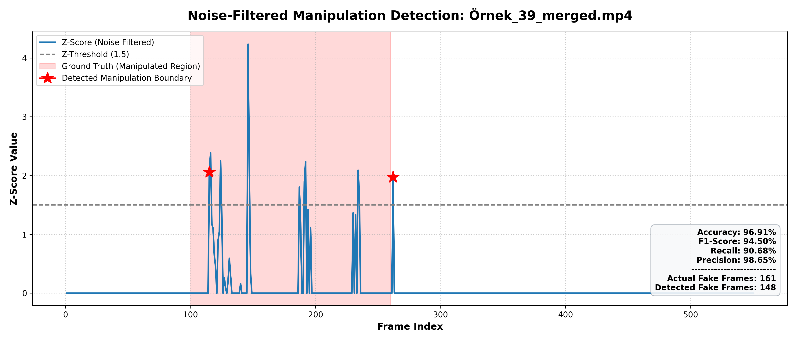
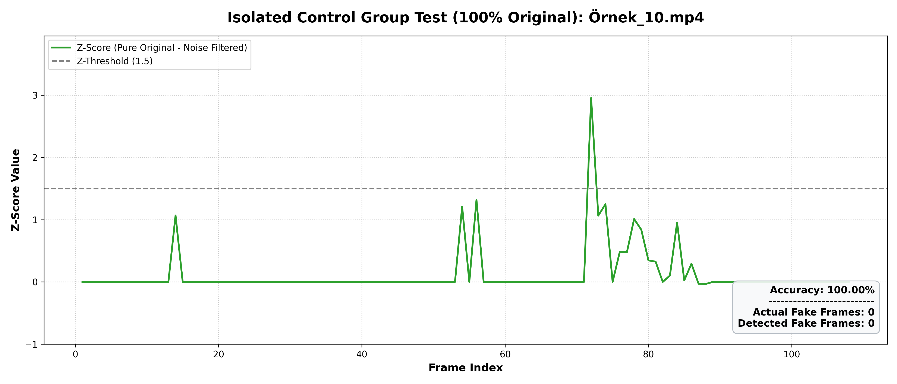

# Detecting Temporally Localized Manipulations in Authentic Video Streams

This repository provides code, metadata, and release notes for the paper:

**Detecting Temporally Localized Manipulations in Authentic Video Streams**

Authors: Okan Umur, Ali Emre Güşlü, Ibrahim Delibasoglu

## Status

This repository is being prepared for release. The paper, code, dataset metadata, and evaluation artifacts are being cleaned and organized.

- Paper: coming soon
- arXiv: coming soon
- Dataset download: under preparation
- Citation: coming soon

## Dataset Description

This work studies a realistic video forensics scenario where a short manipulated segment is inserted into an otherwise authentic video stream and the original footage resumes afterward. This differs from many existing video forgery datasets that focus on fully manipulated videos, face-centric deepfakes, object removal, or audio-only manipulations.

The custom evaluation set contains:

- 100 pure authentic control videos
- 100 generated manipulation segments
- 100 partially manipulated merged videos

The merged videos follow this temporal structure:

```text
authentic frames -> inserted manipulated segment -> authentic continuation
```

Dense frame-level labels mark the inserted manipulation intervals.

## Dataset Structure

The dataset release is organized conceptually as follows:

```text
dataset/
+-- authentic/       Pure authentic control videos
+-- fake_segments/   Generated manipulation segments
+-- merged/          Partially manipulated videos
+-- metadata/        Frame insertion logs and labels
```

The full video files are not included in this GitHub repository. Dataset release details will be added after licensing and redistribution checks are completed.

## Metadata

The `data/` directory contains lightweight metadata describing the frame insertion process:

- `video_name`
- `original_frames`
- `fake_frames_added`
- `start_frame`
- `end_frame`
- `total_frames_after_merge`
- `fps_original`
- `fps_fake`

See [data/frame_insertion_metadata.csv](data/frame_insertion_metadata.csv).

## Manipulation Scenario

For each authentic source video, the 100th frame is used as the transition point. A generated manipulation segment is inserted after the first 99 authentic frames, and the remaining authentic video continues after the inserted segment.

This creates a challenging temporally localized manipulation setting where the forged region is short relative to the full video and must remain visually coherent with the surrounding authentic content.

## Detection Methods

The paper evaluates two complementary approaches:

1. **Linear Probe on DINOv3 Features**
   - Supervised baseline using frozen DINOv3 features.
   - Evaluated with fixed, adaptive, and sliding-window thresholding.

2. **DINOv3 Feature Similarity**
   - Training-free temporal anomaly detection method.
   - Uses consecutive-frame cosine distance, local Z-score normalization, and a minimum distance threshold.

## Main Results

### Feature Similarity on Merged Videos

| Metric | Value |
| --- | ---: |
| Total processed frames | 52,889 |
| Total actual fake frames | 15,566 |
| Total detected fake frames | 10,059 |
| Global accuracy | 83.12% |
| Global precision | 83.00% |
| Global recall | 53.64% |
| Global F1-score | 65.16% |

### Pure Authentic Control Group

| Metric | Value |
| --- | ---: |
| Total tested videos | 100 |
| Videos with zero errors | 95 |
| Videos with false alarms | 5 |
| Video-level accuracy | 95.00% |
| Total processed frames | 37,423 |
| True negative frames | 36,558 |
| False positive frames | 865 |
| Frame-level accuracy | 97.69% |

## Repository Layout

```text
.
+-- data/         Dataset metadata and release notes
+-- docs/         Reproducibility and repository preparation notes
+-- figures/      Selected figures and result visualizations
+-- paper/        Paper and citation notes
+-- src/          Code organization notes and scripts
+-- README.md
+-- requirements.txt
```

## Examples

### Temporal Manipulation Sequence

The core dataset scenario inserts a short manipulated segment into an otherwise authentic video stream:

```text
Step 1: authentic video frames -> Step 2: inserted manipulated segment -> Step 3: authentic continuation
```

The table below shows three representative examples of this temporal structure.

| Example | Step 1: Original video | Step 2: Manipulated segment | Step 3: Original continuation |
| --- | --- | --- | --- |
| Example 1 |  |  |  |
| Example 2 |  |  |  |
| Example 3 |  |  |  |

### Detection Trajectories

Example output from the DINOv3 feature similarity approach:



Example true-negative trajectory from the pure authentic control group:



## Code

The cleaned evaluation code will be added to `src/`. The planned script organization includes:

- feature extraction
- consecutive-frame distance computation
- feature similarity evaluation
- pure authentic control evaluation
- plotting utilities

## Dataset Availability

The dataset contains mixed-source authentic videos, generated manipulation segments, and derived merged videos. Because licensing and redistribution permissions may vary by source, the full dataset release will be documented separately.

## Citation

Citation information will be added after the arXiv record is available.

## License

License information will be added before the first stable release. Dataset redistribution terms may differ from code licensing terms.

## Contact

For questions, please contact the authors after the public release information is finalized.
